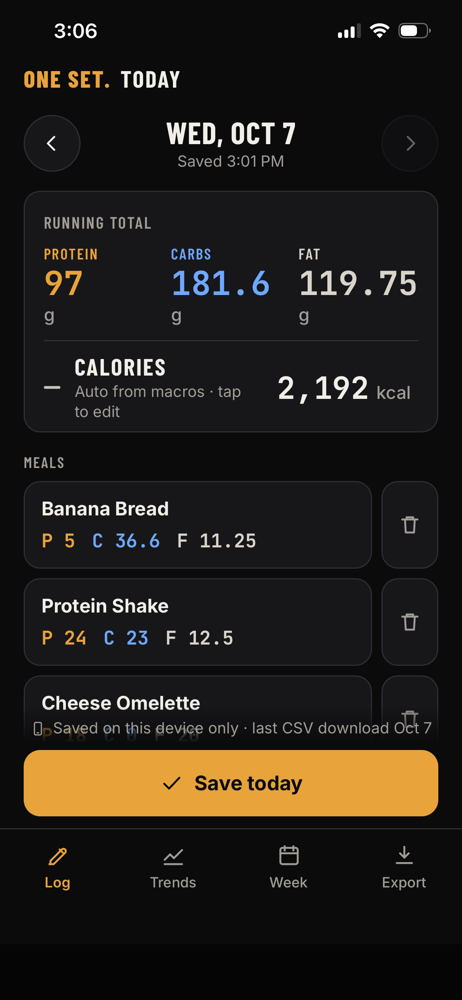
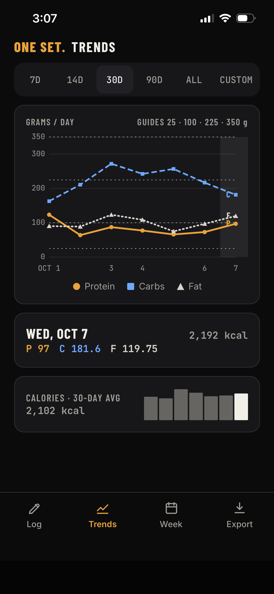
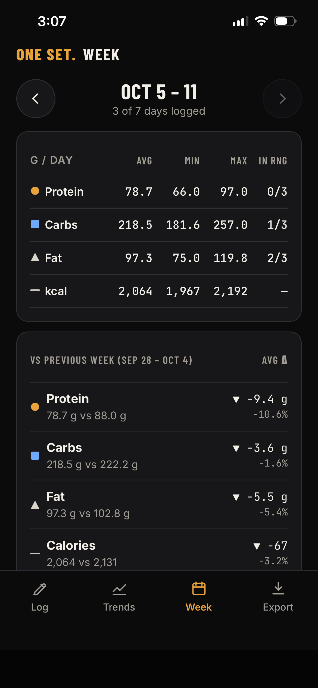
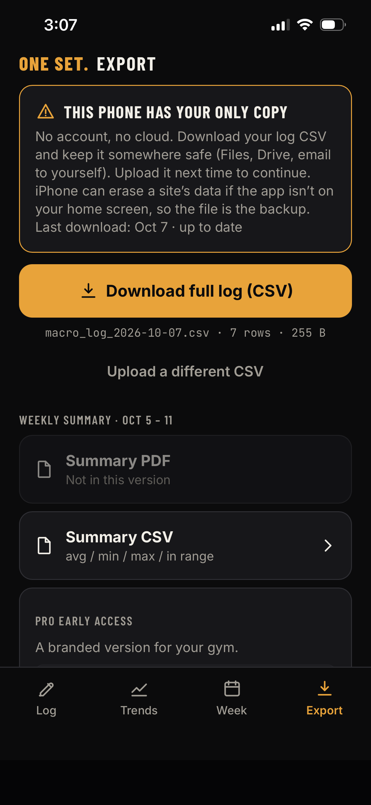

# ONE SET. — architecture notes

A one-page note for an Aion Consulting portfolio piece. The product is a daily macro log: meals and snacks through the day, saved as one total for protein, carbs, fat, and calories.

## What it is

ONE SET. is a static progressive web app. The installed copy is the site itself. After the first load, a service worker keeps the shell on the phone, so a gym basement with no signal can still open the log.

There is no account, no API, and no database on a server. The log lives in IndexedDB under two separate buckets: the person’s own entries, and a bundled sample history used only for the public demo. Uploading a CSV always writes the personal bucket. Clearing the sample does not touch it.

The portable copy is a CSV the person downloads. The Export screen is built around that fact: this phone has the only copy, unless they have saved the file somewhere else. iPhone can drop site data when the app is not installed to the home screen, which is why the download is the backup rather than a nice-to-have.

The static build is served at the domain root on Cloudflare Pages. The service worker scope is `/`. IndexedDB is stored per origin, so a log saved on the previous GitHub Pages host (`https://aiontrust.github.io/macro-tracker/`) stays on that origin. Export the CSV there and import it on the new site.

## How a day is stored

Blank cells are missing. They are not zeros, and they are left out of averages, minimums, and days-in-range. A day that was never saved is not invented.

Meals and snacks are stored on the device as soon as they are added. Each one can have a name and protein, carbs, and fat in grams. Blank grams stay missing. The Today screen totals them as they change. Save this day writes one summed row into the daily log. Trends, Week, and Export still read that row. Target ranges stay on the day.

Calories are `4×protein + 4×carbs + 9×fat` only when a day is saved with all three macros filled and the calorie field left blank. A number the person types is stored as an override. Opening an old file does not recompute calories that were blank, and it does not replace an override.

Target ranges default to 125–250 g for each macro and can be changed per macro. Days in range use that band. Week-over-week deltas are an arrow and a sign. They are not colored, because up is not automatically good.

## Demo and what is not here

`?demo=1` loads an anonymized history: dates shifted, numbers only, no names or notes. The source file is not in the repository. The newest sample days are calories only, so the sample opens on the latest stretch that still has protein, carbs, and fat. A person’s own log still opens on today.

Not in this version: accounts, sync, a leaderboard, PDF export, and the app stores. A disabled email field on Export is the hook for a later branded gym version. It stays off until a form endpoint is configured. See `pwa/README.md`.

## Screenshots

These are from a personal log on the live app, included with permission.

<table>
  <tr>
    <td align="center" valign="top" width="25%">
       
      Meal logging with running totals
    </td>
    <td align="center" valign="top" width="25%">
       
      Trends chart
    </td>
    <td align="center" valign="top" width="25%">
       
      Weekly summary
    </td>
    <td align="center" valign="top" width="25%">
       
      Export and backup
    </td>
  </tr>
</table>
